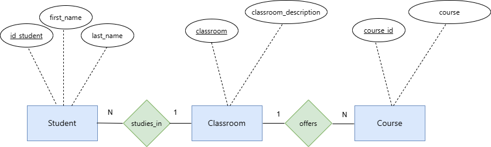
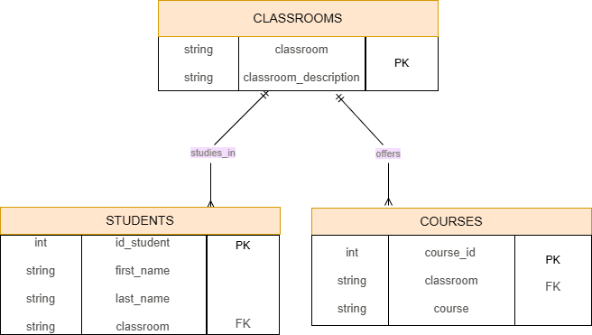

# Database Normalization Project

[cite_start]This project focuses on the normalization of a database table, applying normalization rules (1NF, 2NF, 3NF) to resolve repeating groups and dependencies, and creating a robust relational database schema.

## Project Description
The original dataset contained repeating groups and partial/transitive dependencies. [cite_start]This project reorganizes the data into atomic, dependency-free tables to ensure data integrity and query efficiency[cite: 1, 2, 9].

## Normalization Process
- [cite_start]**1NF (First Normal Form):** Resolved repeating course columns by ensuring each field is atomic[cite: 1, 9].
- [cite_start]**2NF (Second Normal Form):** Separated students and courses into distinct tables, defining proper Primary Keys (PK) to eliminate partial dependencies.
- [cite_start]**3NF (Third Normal Form):** Moved classroom descriptions to a separate `Classrooms` table to eliminate transitive dependencies and ensure full functional dependency.

## Database Schema

### ER Diagram (Chen)

### Database Schema (Crow's Foot)

## Repository Structure
- `/diagrams`: Contains ER and Crow's Foot diagrams.
- [cite_start]`normalized-tables.md`: Detailed documentation of the normalization steps.

---
*This project was prepared following standard database design principles.*